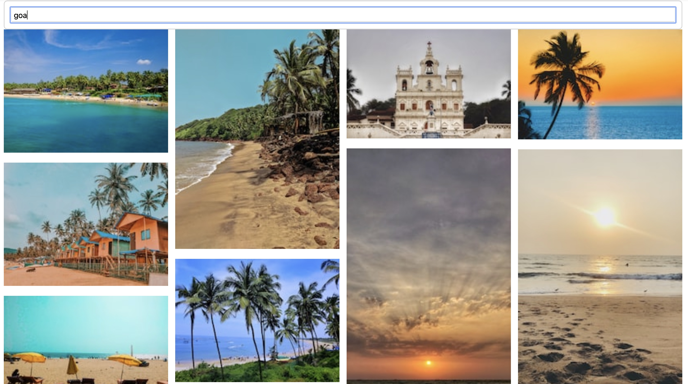

# React API Image App

## This application pulls image data from Unsplash.com, which provides a free api for developers to use. 

  

###  This project was build using the following tech stack 

> React.js Framework
> HTML
> CSS
> Javascript

  

### I made use of several react components and features for this project like state, props, rendering, array destructing, mapping, etc. Also learned about several features within browsers for developers, and how requests are made to and from apis. 

  

>Some sample images from my finished application

